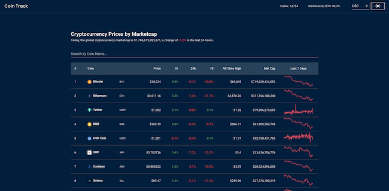

# The Coin Track

  <kbd>
    
  </kbd>

## Description

A React application styled using Material UI. The app visualizes realtime cryptocurrency prices and displays price difference percentages over different periods of time. The data is fetched from the CoinGecko API and displayed in responsive React components. Users are able to click on each coin to reveal more data and see real time graphs and up to date descriptions.

My aim with building this project was to better my understanding of React and how to effectively use reusable components. I wanted to learn how to use Material UI with React and I was looking to broaden my knowledge of using an API to dynamically display data.

### Built with

- React
- Material UI

### Installation

npm install

### Legal disclaimer

Usage of this tool for attacking targets without prior mutual consent is illegal. It is the end user's responsibility to obey all applicable local, state, and federal laws. Developers assume no liability and are not responsible for any misuse or damage caused by this program.

### License

This project is licensed under the [MIT License](LICENSE.md).
